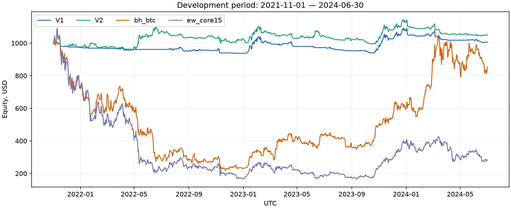
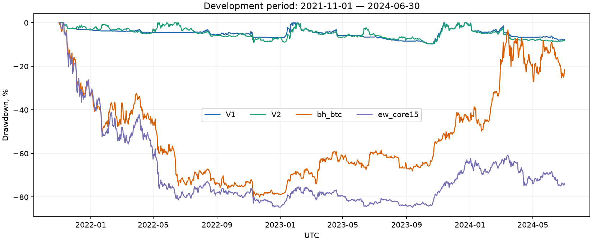
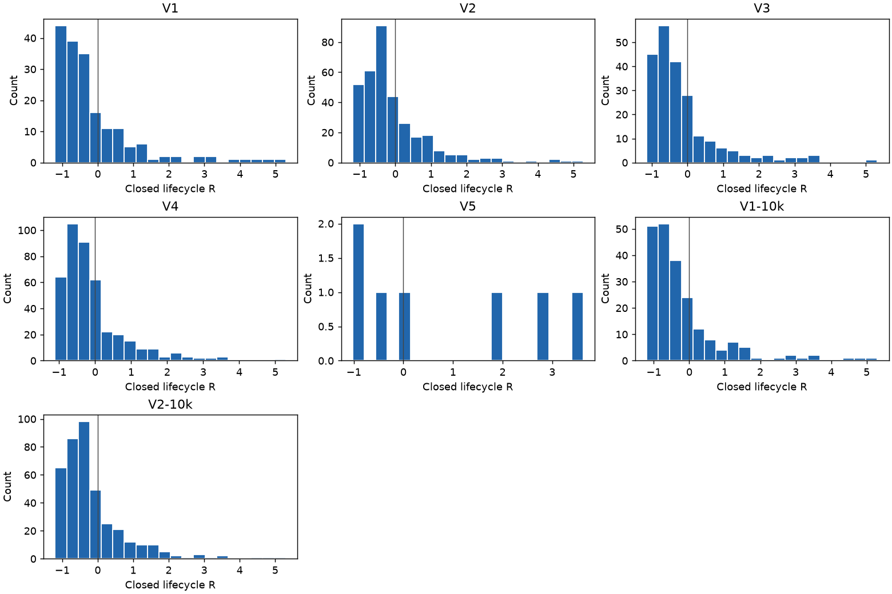

# T004 — факты на периоде разработки

Период: **2021-11-01–2024-06-30 UTC**, 973 полных дня. Разогрев индикаторов — с 2021-01-01; первые сделки только с начала dev. Конечные позиции переоценены без фиктивного закрытия. В 2021 году показаны ноябрь–декабрь, в 2024 — январь–июнь.

Периоды, параметры, семь вариантов и расчётные соглашения зарегистрированы первым коммитом **9af0721**, отправленным в GitHub до реализации и прогонов. Все новые прогоны T004 сделаны на чистом коде **728793d4f21392ecba0562600f6eff03c3f16d40**. Параметры после просмотра результатов не менялись; новых вариантов нет. Выбор варианта относится к T005.

## Метрики всех вариантов

Таблица ниже — округлённое представление метрик из `tb backtest compare`. [Полный вывод compare](T004-compare.md), [конфигурации, версии и контрольные суммы артефактов](T004-runs.json).

| ID | Капитал, $ | Итог, $ | Доходность | CAGR | Волатильность | Sharpe | Max DD | Закрытых / открытых |
|---|---|---|---|---|---|---|---|---|
| V1 | 1000 | 1005.96 | 0.60% | 0.22% | 7.56% | 0.067 | -9.64% | 181 / 1 |
| V2 | 1000 | 1049.77 | 4.98% | 1.84% | 9.93% | 0.233 | -9.77% | 341 / 9 |
| V3 | 1000 | 976.51 | -2.35% | -0.89% | 7.62% | -0.079 | -8.06% | 220 / 1 |
| V4 | 1000 | 1028.40 | 2.84% | 1.06% | 10.46% | 0.153 | -10.91% | 417 / 10 |
| V5 | 1000 | 1020.33 | 2.03% | 0.76% | 0.92% | 0.828 | -1.01% | 7 / 0 |
| V1-10k | 10000 | 9691.69 | -3.08% | -1.17% | 8.32% | -0.099 | -10.44% | 211 / 1 |
| V2-10k | 10000 | 10186.77 | 1.87% | 0.70% | 11.51% | 0.118 | -13.44% | 393 / 12 |
| bh_btc | 1000 | 852.86 | -14.71% | -5.80% | 60.95% | 0.208 | -80.00% | 0 / 1 |
| ew_core15 | 1000 | 283.43 | -71.66% | -37.68% | 64.35% | -0.408 | -84.77% | 118 / 13 |

**Ценовая доходность BTC без фандинга и издержек: 2.30%.** Чистый эталон BTC уплатил фандинга $188.04, получил $19.06; net $-168.99. Его доходность с издержками: -14.71%.

V1/V2 — дневные long_only/long_short, V3/V4 — соответствующие 4h, V5 — дневной long_only только BTC; варианты 10k отличаются исходным капиталом. Во всех трендовых вариантах лимиты gross/net/symbol 2/1.5/0.5, риск полного сигнала на символ 0.5%, стоп 3 дневных ATR, полоса 25%. Стоимость исполнения: taker 5.5 bps, обычное проскальзывание 2 bps, стоп 5 bps, делистинг 200 bps. BTC держит 0.016 BTC одним входом; равновесный эталон ребалансируется ежемесячно с прежними лимитами.

## Капитал и просадка

## По годам

Доходность внутри соответствующего календарного фрагмента, с капитализацией результата предыдущих лет. Неполные 2021 и 2024 нельзя сравнивать с полными годами без учёта длины периода.

| ID | 2021 ноя–дек | 2022 | 2023 | 2024 янв–июн |
|---|---|---|---|---|
| V1 | -2.71% | -3.63% | 14.68% | -6.44% |
| V2 | -2.19% | 4.80% | 9.94% | -6.85% |
| V3 | -2.53% | -4.27% | 9.69% | -4.60% |
| V4 | -2.31% | 3.57% | 6.16% | -4.25% |
| V5 | 0.00% | 0.00% | 0.76% | 1.27% |
| V1-10k | -3.50% | -5.35% | 15.64% | -8.23% |
| V2-10k | -2.84% | 5.54% | 9.00% | -8.86% |
| bh_btc | -27.90% | -68.04% | 159.33% | 42.71% |
| ew_core15 | -27.72% | -76.88% | 129.58% | -26.12% |

## Экспозиция и заявки

Средние/максимумы измерены на закрытиях баров; net со знаком, максимум abs(net) отдельно. Инвариант лимитов относится к моменту после ребалансировки и издержек. У фиксированного BTC лимиты отключены: фандинг уменьшает капитал и может повысить отношение позиции к капиталу выше единицы.

| ID | Средняя gross | Макс. gross | Средняя net | Макс. abs(net) | Макс. symbol после ребал. | Пропуски min | Расширения сокращений |
|---|---|---|---|---|---|---|---|
| V1 | 0.0582 | 0.4000 | 0.0582 | 0.4000 | 0.0635 | 1168 | 10 |
| V2 | 0.1170 | 0.4018 | -0.0053 | 0.4018 | 0.0611 | 3383 | 40 |
| V3 | 0.0573 | 0.4985 | 0.0573 | 0.4985 | 0.0661 | 6487 | 12 |
| V4 | 0.1197 | 0.4915 | -0.0062 | 0.4915 | 0.0670 | 17897 | 54 |
| V5 | 0.0071 | 0.0670 | 0.0071 | 0.0670 | 0.0622 | 384 | 0 |
| V1-10k | 0.0680 | 0.4351 | 0.0680 | 0.4351 | 0.0647 | 29 | 1 |
| V2-10k | 0.1398 | 0.4235 | -0.0097 | 0.4235 | 0.0631 | 101 | 1 |
| bh_btc | 1.1066 | 1.1868 | 1.1066 | 1.1868 | 1.1867 | 0 | 0 |
| ew_core15 | 0.7922 | 0.9781 | 0.7922 | 0.9781 | 0.1582 | 242 | 47 |

Во всех семи трендовых прогонах фактические gross/net/symbol после каждой ребалансировки соблюдают лимиты с допуском 1e−9. Цена и выплаты внутри бара могут изменить отношения после этой проверки. Пропуск — событие попытки заявки, а не уникальный сигнал: невозможный вход может повторяться на нескольких закрытиях.

## $1000 и $10 000

| Пара | Доходность $1000 | Доходность $10000 | Разница 10k−1k, п.п. | Пропуски 1k / 10k | Средняя gross 1k / 10k |
|---|---|---|---|---|---|
| V1 | 0.60% | -3.08% | -3.68 | 1168 / 29 | 0.0582 / 0.0680 |
| V2 | 4.98% | 1.87% | -3.11 | 3383 / 101 | 0.1170 / 0.1398 |

Больший счёт пропускает меньше заявок и в среднем держит большую gross-экспозицию, однако в обоих сравнениях его процентная доходность ниже. В этой модели абсолютные биржевые минимумы и шаги нарушают масштабируемость; далее расходятся состав исполнений, капитал, размеры и сроки позиций. Это наблюдаемая зависимость от дискретности счёта, а не доказательство преимущества малого капитала. По этим двум размерам нельзя оценить результат с бесконечно точным количеством.

## Издержки по направлениям

Включены закрытые и оставшиеся открытыми жизненные циклы. Фандинг paid/received показан валовыми суммами; net положителен для поступлений. В процентах знаменатель — сумма положительных gross PnL жизненных циклов соответствующей стороны, включая конечную переоценку. Отрицательная доля net-фандинга означает расход; при нулевом знаменателе — прочерк.

| ID | Сторона | Комиссии $ / % | Проскальзывание $ / % | Funding paid $ | Received $ | Net $ / % |
|---|---|---|---|---|---|---|
| V1 | long | 3.472 / 1.34 | 1.983 / 0.76 | 29.654 | 12.156 | -17.498 / -6.73 |
| V1 | short | 0.000 / — | 0.000 / — | 0.000 | 0.000 | 0.000 / — |
| V2 | long | 3.531 / 1.31 | 2.034 / 0.75 | 30.721 | 12.317 | -18.404 / -6.83 |
| V2 | short | 2.837 / 1.41 | 1.463 / 0.73 | 15.341 | 11.189 | -4.152 / -2.06 |
| V3 | long | 4.405 / 1.61 | 2.534 / 0.93 | 27.393 | 12.871 | -14.521 / -5.32 |
| V3 | short | 0.000 / — | 0.000 / — | 0.000 | 0.000 | 0.000 / — |
| V4 | long | 4.642 / 1.62 | 2.656 / 0.93 | 28.430 | 13.413 | -15.017 / -5.25 |
| V4 | short | 3.335 / 1.43 | 1.697 / 0.73 | 15.036 | 11.598 | -3.438 / -1.47 |
| V5 | long | 0.310 / 0.94 | 0.174 / 0.52 | 2.683 | 0.108 | -2.575 / -7.78 |
| V5 | short | 0.000 / — | 0.000 / — | 0.000 | 0.000 | 0.000 / — |
| V1-10k | long | 41.218 / 1.49 | 23.651 / 0.85 | 334.856 | 126.322 | -208.534 / -7.53 |
| V1-10k | short | 0.000 / — | 0.000 / — | 0.000 | 0.000 | 0.000 / — |
| V2-10k | long | 41.905 / 1.42 | 23.973 / 0.81 | 347.861 | 129.871 | -217.990 / -7.37 |
| V2-10k | short | 33.980 / 1.44 | 17.820 / 0.76 | 176.960 | 138.465 | -38.495 / -1.63 |
| bh_btc | long | 0.540 / 2.39 | 0.196 / 0.87 | 188.044 | 19.058 | -168.986 / -748.25 |
| bh_btc | short | 0.000 / — | 0.000 / — | 0.000 | 0.000 | 0.000 / — |
| ew_core15 | long | 3.305 / 1.16 | 1.203 / 0.42 | 115.048 | 59.339 | -55.708 / -19.60 |
| ew_core15 | short | 0.000 / — | 0.000 / — | 0.000 | 0.000 | 0.000 / — |

## Распределение результатов позиций в R

Только полностью закрытые жизненные циклы; знаменатель — максимальный принятый риск фактического номинала за цикл. При добавлении риск может увеличиваться, при сокращении не уменьшается. Комиссии, проскальзывание и подписанный фандинг входят в числитель net PnL. Результаты R у эталонов отсутствуют: им не назначается риск стопа.

| ID | Число | Win rate | Средний выигрыш R | Средний проигрыш R | Min | Q25 | Медиана | Q75 | Max |
|---|---|---|---|---|---|---|---|---|---|
| V1 | 181 | 28.73% | 1.261 | -0.667 | -1.198 | -0.832 | -0.462 | 0.165 | 5.289 |
| V2 | 341 | 29.62% | 1.057 | -0.552 | -1.198 | -0.689 | -0.333 | 0.182 | 5.276 |
| V3 | 220 | 25.45% | 1.207 | -0.584 | -1.139 | -0.735 | -0.470 | 0.028 | 5.320 |
| V4 | 417 | 29.02% | 0.973 | -0.521 | -1.108 | -0.625 | -0.362 | 0.095 | 5.290 |
| V5 | 7 | 42.86% | 2.783 | -0.606 | -1.021 | -0.679 | -0.045 | 2.362 | 3.627 |
| V1-10k | 211 | 25.59% | 1.177 | -0.669 | -1.198 | -0.852 | -0.528 | 0.013 | 5.304 |
| V2-10k | 393 | 26.72% | 1.035 | -0.582 | -1.198 | -0.742 | -0.386 | 0.056 | 5.299 |

### V1: пять лучших и пять худших по R

| Группа | Символ | Сторона | Вход UTC | Выход UTC | R | Net, $ |
|---|---|---|---|---|---|---|
| Лучшие | RUNEUSDT | long | 2023-10-24 | 2023-11-20 | 5.289 | 25.342 |
| Лучшие | OPUSDT | long | 2023-01-07 | 2023-02-14 | 4.738 | 14.841 |
| Лучшие | OPUSDT | long | 2023-10-25 | 2024-01-04 | 4.553 | 7.186 |
| Лучшие | SOLUSDT | long | 2023-10-21 | 2023-11-22 | 4.162 | 18.232 |
| Лучшие | FTMUSDT | long | 2023-01-08 | 2023-02-10 | 3.685 | 17.984 |
| Худшие | XRPUSDT | long | 2023-12-09 | 2024-01-04 | -1.198 | -2.111 |
| Худшие | XRPUSDT | long | 2024-03-03 | 2024-03-06 | -1.059 | -3.769 |
| Худшие | ETCUSDT | long | 2021-11-10 | 2021-11-17 | -1.057 | -2.476 |
| Худшие | RUNEUSDT | long | 2023-12-03 | 2023-12-12 | -1.055 | -5.437 |
| Худшие | GALAUSDT | long | 2023-12-26 | 2024-01-04 | -1.053 | -5.734 |

### V2: пять лучших и пять худших по R

| Группа | Символ | Сторона | Вход UTC | Выход UTC | R | Net, $ |
|---|---|---|---|---|---|---|
| Лучшие | RUNEUSDT | long | 2023-10-24 | 2023-11-20 | 5.276 | 26.688 |
| Лучшие | OPUSDT | long | 2023-01-07 | 2023-02-14 | 4.740 | 15.811 |
| Лучшие | OPUSDT | long | 2023-10-25 | 2024-01-04 | 4.607 | 7.645 |
| Лучшие | SOLUSDT | long | 2023-10-21 | 2023-11-22 | 4.410 | 21.463 |
| Лучшие | FTMUSDT | long | 2023-01-08 | 2023-02-10 | 3.699 | 19.079 |
| Худшие | XRPUSDT | long | 2023-12-09 | 2024-01-04 | -1.198 | -2.216 |
| Худшие | XRPUSDT | long | 2024-03-03 | 2024-03-06 | -1.059 | -3.921 |
| Худшие | ETCUSDT | long | 2021-11-10 | 2021-11-17 | -1.057 | -2.476 |
| Худшие | RUNEUSDT | long | 2023-12-03 | 2023-12-12 | -1.055 | -5.601 |
| Худшие | GALAUSDT | long | 2023-12-26 | 2024-01-04 | -1.053 | -6.011 |

### V3: пять лучших и пять худших по R

| Группа | Символ | Сторона | Вход UTC | Выход UTC | R | Net, $ |
|---|---|---|---|---|---|---|
| Лучшие | SOLUSDT | long | 2023-10-19 | 2023-11-21 | 5.320 | 23.713 |
| Лучшие | FTMUSDT | long | 2023-01-07 | 2023-02-09 | 3.606 | 17.581 |
| Лучшие | BTCUSDT | long | 2023-10-23 | 2023-12-11 | 3.527 | 8.703 |
| Лучшие | LINKUSDT | long | 2023-10-21 | 2023-11-14 | 3.386 | 15.927 |
| Лучшие | BTCUSDT | long | 2023-01-09 | 2023-02-10 | 3.360 | 7.528 |
| Худшие | ATOMUSDT | long | 2022-08-08 | 2022-08-29 | -1.139 | -5.282 |
| Худшие | ETHUSDT | long | 2023-12-28 | 2024-01-03 | -1.069 | -3.099 |
| Худшие | GALAUSDT | long | 2023-12-25 | 2024-01-03 | -1.060 | -5.533 |
| Худшие | BLZUSDT | long | 2023-10-31 | 2023-11-09 | -1.042 | -5.138 |
| Худшие | LINKUSDT | long | 2023-12-28 | 2024-01-03 | -1.039 | -5.315 |

### V4: пять лучших и пять худших по R

| Группа | Символ | Сторона | Вход UTC | Выход UTC | R | Net, $ |
|---|---|---|---|---|---|---|
| Лучшие | SOLUSDT | long | 2023-10-19 | 2023-11-21 | 5.290 | 25.937 |
| Лучшие | FTMUSDT | long | 2023-01-07 | 2023-02-09 | 3.619 | 18.511 |
| Лучшие | LINKUSDT | long | 2023-10-21 | 2023-11-14 | 3.510 | 17.242 |
| Лучшие | LUNAUSDT | short | 2022-05-07 | 2022-05-12 | 3.463 | 7.465 |
| Лучшие | BTCUSDT | long | 2023-01-09 | 2023-02-10 | 3.360 | 7.528 |
| Худшие | ATOMUSDT | long | 2022-08-08 | 2022-08-29 | -1.108 | -5.439 |
| Худшие | ETHUSDT | long | 2023-12-28 | 2024-01-03 | -1.069 | -3.099 |
| Худшие | GALAUSDT | long | 2023-12-25 | 2024-01-03 | -1.060 | -5.799 |
| Худшие | BLZUSDT | long | 2023-10-31 | 2023-11-09 | -1.042 | -5.379 |
| Худшие | LINKUSDT | long | 2023-12-28 | 2024-01-03 | -1.039 | -5.669 |

### V5: пять лучших и пять худших по R

| Группа | Символ | Сторона | Вход UTC | Выход UTC | R | Net, $ |
|---|---|---|---|---|---|---|
| Лучшие | BTCUSDT | long | 2024-02-13 | 2024-03-05 | 3.627 | 17.428 |
| Лучшие | BTCUSDT | long | 2023-01-09 | 2023-02-11 | 2.853 | 7.133 |
| Лучшие | BTCUSDT | long | 2023-10-24 | 2023-12-12 | 1.870 | 6.310 |
| Лучшие | BTCUSDT | long | 2023-03-18 | 2023-04-22 | -0.045 | -0.160 |
| Лучшие | BTCUSDT | long | 2023-06-22 | 2023-07-25 | -0.411 | -1.261 |
| Худшие | BTCUSDT | long | 2024-01-03 | 2024-01-04 | -1.021 | -4.647 |
| Худшие | BTCUSDT | long | 2023-02-16 | 2023-03-04 | -0.947 | -4.469 |
| Худшие | BTCUSDT | long | 2023-06-22 | 2023-07-25 | -0.411 | -1.261 |
| Худшие | BTCUSDT | long | 2023-03-18 | 2023-04-22 | -0.045 | -0.160 |
| Худшие | BTCUSDT | long | 2023-10-24 | 2023-12-12 | 1.870 | 6.310 |

### V1-10k: пять лучших и пять худших по R

| Группа | Символ | Сторона | Вход UTC | Выход UTC | R | Net, $ |
|---|---|---|---|---|---|---|
| Лучшие | RUNEUSDT | long | 2023-10-24 | 2023-11-20 | 5.304 | 248.967 |
| Лучшие | SOLUSDT | long | 2023-10-21 | 2023-11-22 | 4.706 | 217.568 |
| Лучшие | OPUSDT | long | 2023-10-25 | 2024-01-04 | 4.642 | 71.399 |
| Лучшие | OPUSDT | long | 2023-01-07 | 2023-02-14 | 3.588 | 169.233 |
| Лучшие | FTMUSDT | long | 2023-01-08 | 2023-02-10 | 3.553 | 171.253 |
| Худшие | XRPUSDT | long | 2023-12-09 | 2024-01-04 | -1.198 | -20.733 |
| Худшие | ETHUSDT | long | 2023-07-14 | 2023-08-02 | -1.137 | -34.978 |
| Худшие | BTCUSDT | long | 2021-11-09 | 2021-11-17 | -1.062 | -47.238 |
| Худшие | XRPUSDT | long | 2024-03-03 | 2024-03-06 | -1.059 | -36.971 |
| Худшие | ETCUSDT | long | 2021-11-10 | 2021-11-17 | -1.057 | -34.666 |

### V2-10k: пять лучших и пять худших по R

| Группа | Символ | Сторона | Вход UTC | Выход UTC | R | Net, $ |
|---|---|---|---|---|---|---|
| Лучшие | RUNEUSDT | long | 2023-10-24 | 2023-11-20 | 5.299 | 263.778 |
| Лучшие | SOLUSDT | long | 2023-10-21 | 2023-11-22 | 4.707 | 231.389 |
| Лучшие | OPUSDT | long | 2023-10-25 | 2024-01-04 | 4.641 | 75.698 |
| Лучшие | OPUSDT | long | 2023-01-07 | 2023-02-14 | 3.599 | 183.891 |
| Лучшие | FTMUSDT | long | 2023-01-08 | 2023-02-10 | 3.560 | 185.798 |
| Худшие | XRPUSDT | long | 2023-12-09 | 2024-01-04 | -1.198 | -21.952 |
| Худшие | ETHUSDT | long | 2023-07-14 | 2023-08-02 | -1.132 | -36.988 |
| Худшие | BTCUSDT | long | 2021-11-09 | 2021-11-17 | -1.062 | -47.238 |
| Худшие | XRPUSDT | long | 2024-03-03 | 2024-03-06 | -1.059 | -38.936 |
| Худшие | ETCUSDT | long | 2021-11-10 | 2021-11-17 | -1.057 | -34.666 |

У V5 семь закрытых позиций, поэтому списки по пять частично пересекаются.

## Вклад символов

Net PnL в долларах, включая открытые позиции по конечной цене. Прочерк означает отсутствие позиций. Сумма каждой колонки совпадает с изменением капитала с допуском 1e−6; значения округлены только при отображении. Колонки 10k имеют в десять раз больший исходный капитал.

| Символ | V1 | V2 | V3 | V4 | V5 | V1-10k | V2-10k | bh_btc | ew_core15 |
|---|---|---|---|---|---|---|---|---|---|
| 1000BONKUSDT | — | — | — | -0.91 | — | — | -6.36 | — | -12.78 |
| 1000FLOKIUSDT | — | — | — | — | — | — | -6.81 | — | -9.86 |
| 1000PEPEUSDT | 0.99 | 1.56 | 3.64 | 2.16 | — | 26.07 | -3.21 | — | 6.21 |
| AAVEUSDT | -2.17 | -2.28 | -2.08 | -6.74 | — | -22.69 | -31.33 | — | -22.91 |
| ADAUSDT | -5.65 | -1.28 | -1.93 | 7.31 | — | -59.52 | -11.89 | — | -57.45 |
| APEUSDT | 1.90 | 3.13 | 0.19 | -5.90 | — | 18.04 | 28.25 | — | -2.42 |
| APTUSDT | -3.05 | -1.64 | -3.43 | -2.73 | — | -30.03 | -23.34 | — | -7.04 |
| ARBUSDT | 1.71 | 4.20 | 2.10 | 8.94 | — | 16.85 | 41.52 | — | 4.50 |
| ATOMUSDT | 2.26 | 11.72 | -7.95 | 4.70 | — | 0.94 | 103.69 | — | -16.59 |
| AVAXUSDT | 18.28 | 12.33 | 0.80 | 1.78 | — | 152.99 | 197.59 | — | 0.94 |
| AXSUSDT | 1.29 | -2.31 | -1.75 | -8.70 | — | 17.30 | -27.46 | — | -3.56 |
| BCHUSDT | -8.09 | -4.75 | -8.66 | -0.05 | — | -84.47 | -53.26 | — | -34.44 |
| BITUSDT | -1.02 | -3.79 | -0.22 | -3.93 | — | -10.11 | -37.78 | — | 0.36 |
| BLURUSDT | — | — | — | -0.24 | — | — | — | — | -1.64 |
| BLZUSDT | 3.27 | 2.95 | -3.32 | -4.07 | — | 33.97 | 31.21 | — | 18.29 |
| BNBUSDT | -5.62 | -18.53 | -5.50 | -17.87 | — | -55.19 | -185.07 | — | -4.64 |
| BTCUSDT | 13.37 | 5.91 | 19.09 | 15.42 | 20.33 | -36.35 | -61.99 | -147.14 | -25.46 |
| CHZUSDT | -0.49 | -4.11 | -4.62 | -10.99 | — | -4.94 | -38.27 | — | -6.25 |
| COMPUSDT | — | 1.34 | — | 1.36 | — | — | 15.95 | — | -4.93 |
| DOGEUSDT | -14.46 | -20.36 | -16.03 | -20.36 | — | -141.49 | -194.92 | — | -67.74 |
| DOTUSDT | -3.09 | -5.39 | -3.26 | -8.79 | — | -34.72 | -43.86 | — | -45.85 |
| DYDXUSDT | — | — | — | — | — | — | -10.31 | — | -2.38 |
| EOSUSDT | -1.63 | 1.52 | -1.46 | 3.80 | — | -17.23 | 20.25 | — | -35.45 |
| ETCUSDT | -2.48 | 2.24 | -3.21 | -0.59 | — | -34.67 | 10.25 | — | -34.24 |
| ETHUSDT | 0.02 | -3.17 | -2.12 | -0.30 | — | -112.00 | -183.70 | — | -14.20 |
| FETUSDT | — | — | — | — | — | — | -4.87 | — | -8.51 |
| FILUSDT | — | 6.15 | — | 6.41 | — | — | 58.59 | — | -34.04 |
| FTMUSDT | 17.37 | 24.68 | 14.92 | 22.99 | — | 148.65 | 249.57 | — | -36.31 |
| GALAUSDT | -4.82 | 6.33 | -11.60 | -0.92 | — | -47.55 | 75.97 | — | -46.86 |
| GMTUSDT | — | 0.31 | -1.26 | -1.69 | — | — | -7.01 | — | -11.07 |
| ICPUSDT | — | -1.58 | — | -2.55 | — | — | -15.86 | — | 0.24 |
| INJUSDT | 7.77 | 9.01 | 9.64 | 7.82 | — | 58.68 | 54.08 | — | 13.82 |
| KNCUSDT | — | — | — | — | — | — | -0.34 | — | -7.94 |
| LDOUSDT | -3.02 | -4.18 | -3.39 | -3.90 | — | -30.82 | -54.10 | — | 0.03 |
| LINAUSDT | — | -0.68 | — | — | — | — | -6.83 | — | -0.87 |
| LINKUSDT | -1.20 | -7.97 | -1.77 | -7.11 | — | -26.17 | -84.16 | — | -27.80 |
| LPTUSDT | — | -1.13 | — | -0.68 | — | — | -14.56 | — | -1.58 |
| LTCUSDT | -10.39 | -15.70 | -5.48 | -9.20 | — | -92.68 | -138.09 | — | -20.69 |
| LUNA2USDT | — | — | — | — | — | — | — | — | -0.34 |
| LUNAUSDT | -1.31 | 5.43 | -0.59 | 6.87 | — | -9.13 | 106.70 | — | -25.50 |
| MASKUSDT | — | -0.96 | — | 0.35 | — | -8.00 | -12.76 | — | -11.18 |
| MATICUSDT | -11.11 | 0.21 | -3.12 | -0.07 | — | -118.73 | -19.73 | — | -16.61 |
| NEARUSDT | -2.54 | 11.40 | -1.32 | 9.42 | — | -22.62 | 103.89 | — | -26.92 |
| ONDOUSDT | -4.45 | -4.73 | -3.23 | -3.21 | — | -44.21 | -46.16 | — | -0.93 |
| OPUSDT | 16.67 | 20.56 | 7.37 | 9.21 | — | 187.88 | 212.63 | — | 10.48 |
| ORDIUSDT | -1.90 | -5.49 | -9.42 | -10.53 | — | -20.25 | -64.12 | — | 2.51 |
| PEOPLEUSDT | -1.05 | -1.10 | -0.62 | -0.63 | — | -10.43 | -10.84 | — | 2.17 |
| RNDRUSDT | — | 0.36 | — | 0.82 | — | — | -0.63 | — | -4.06 |
| RUNEUSDT | 16.59 | 16.18 | 12.07 | 10.28 | — | 163.43 | 191.12 | — | 2.67 |
| SANDUSDT | -1.74 | 10.01 | -2.23 | 6.27 | — | -17.33 | 109.13 | — | -25.94 |
| SEIUSDT | -10.57 | -8.44 | -8.52 | -3.79 | — | -108.38 | -80.89 | — | 0.56 |
| SHIB1000USDT | -2.28 | 2.42 | -2.23 | 5.52 | — | -22.45 | 25.77 | — | -32.88 |
| SOLUSDT | 23.82 | 28.45 | 32.39 | 37.72 | — | 271.76 | 320.85 | — | 19.35 |
| STXUSDT | — | -0.40 | — | 0.70 | — | — | -9.88 | — | -3.86 |
| SUIUSDT | -0.25 | -3.21 | -3.27 | -5.18 | — | -51.92 | -58.20 | — | 6.58 |
| SUSHIUSDT | -5.69 | -8.66 | -5.11 | -6.54 | — | -58.44 | -102.21 | — | -5.11 |
| SXPUSDT | — | -1.58 | — | -0.90 | — | — | -14.46 | — | -3.41 |
| TIAUSDT | — | 1.48 | — | 1.91 | — | — | 16.78 | — | -4.63 |
| TOMOUSDT | -0.61 | -0.66 | -0.88 | -0.92 | — | -6.02 | -6.47 | — | 4.16 |
| TONUSDT | -0.20 | -0.10 | 0.06 | -0.11 | — | 3.74 | 3.85 | — | 8.27 |
| TRBUSDT | 11.03 | 10.41 | 9.87 | 9.88 | — | 119.27 | 112.26 | — | 47.76 |
| TRXUSDT | — | -3.57 | -0.97 | -1.42 | — | — | -36.93 | — | -3.62 |
| UNFIUSDT | 0.81 | 0.07 | -0.36 | -0.34 | — | 19.48 | 1.40 | — | 3.68 |
| WAVESUSDT | — | -0.60 | — | -1.20 | — | -5.71 | -19.04 | — | 1.68 |
| WIFUSDT | — | -0.38 | — | 0.18 | — | — | -7.42 | — | -6.88 |
| WLDUSDT | — | 5.01 | — | 4.24 | — | — | 28.06 | — | -22.43 |
| XRPUSDT | -20.30 | -12.71 | -3.52 | 3.88 | — | -203.11 | -137.31 | — | -38.05 |
| XTZUSDT | — | -4.16 | -1.19 | -8.47 | — | — | -53.92 | — | -32.84 |
| YGGUSDT | — | — | — | — | — | — | -6.24 | — | -0.20 |

## Данные, доступ и воспроизводимость

Использован локальный снимок Bybit 2026-09-28, включая Closed, и вселенная core15 T002a. Для dev загружены 69 когда-либо выбранных до конца dev символов; V5 и BTC загружают только BTC. Свечи до 2021-01-01 и после dev не передаются в хранилище прогона; фандинг обрезан концом dev. Состав на момент времени не использует будущий делистинг как фильтр. Сам пул инструментов и биржевые фильтры остаются текущими — остаточная ошибка выжившего и отсутствие исторических шагов/минимумов сохраняются.

| ID | Funding observed / expected | Покрытие | Пропуски | Делистинги |
|---|---|---|---|---|
| V1 | 10877 / 10877 | 100.00% | 0 | 0 |
| V2 | 27238 / 27238 | 100.00% | 0 | 1 |
| V3 | 9665 / 9665 | 100.00% | 0 | 0 |
| V4 | 26486 / 26486 | 100.00% | 0 | 1 |
| V5 | 558 / 558 | 100.00% | 0 | 0 |
| V1-10k | 12158 / 12158 | 100.00% | 0 | 0 |
| V2-10k | 31747 / 31747 | 100.00% | 0 | 1 |
| bh_btc | 2918 / 2918 | 100.00% | 0 | 0 |
| ew_core15 | 40095 / 40095 | 100.00% | 0 | 1 |

Ожидаемые выплаты восстановлены по соседним историческим меткам каждого символа. Пропущенных выплат при открытой позиции не обнаружено; повторная синхронизация диапазонов не требуется. Это не доказательство полноты официального расписания: систематически отсутствующие записи не всегда различимы по одним меткам. У части Closed нет minNotionalValue; применяются известные минимумы количества, предупреждение сохранено в отчётах.

Повтор V1: **fills, positions, equity, events parquet и metrics.json побайтово идентичны**. Все манифесты реальных dev-прогонов: git.dirty=false, один коммит кода. Файл `reports/period-access-log.jsonl` не создан: допусков трендовой стратегии к val/holdout/full не было. Проверки защищённых периодов выполнялись только на синтетике во временных каталогах pytest. 226 offline-тестов; ruff, форматирование, mypy проходят. CI реализации зелёный на [Ubuntu и Windows](https://github.com/branch-danya-dev/trending-basket/actions/runs/36508577673).

### Каталоги исходных отчётов

| ID | Каталог |
|---|---|
| V1 | reports/V1-20260929T013454Z |
| V2 | reports/V2-20260929T013500Z |
| V3 | reports/V3-20260929T013515Z |
| V4 | reports/V4-20260929T013534Z |
| V5 | reports/V5-20260929T013537Z |
| V1-10k | reports/V1-10k-20260929T013543Z |
| V2-10k | reports/V2-10k-20260929T013549Z |
| bh_btc | reports/bh_btc-20260929T013552Z |
| ew_core15 | reports/ew_core15-20260929T013557Z |
| V1-repeat | reports/V1-20260929T013603Z |

Для воспроизведения: подготовить кэш и core15 по README; выполнить `uv run tb backtest run experiments/<ID>.toml` для семи ID и двух эталонов, затем `uv run tb backtest compare` с полученными каталогами. Исходные parquet и полные манифесты остаются локально в игнорируемом reports; в Git сохранены сводка, графики, полный compare и контрольные суммы.

## Аудит BTC на точном прежнем периоде T003

Это отдельный **эталон**, 2021-11-01–2026-09-27, $1000; он не является прогоном трендовой стратегии на holdout. Конечная дата определена через переданный ManualClock(2026-09-28T00:00Z), а время публикации — через SystemClock. Во всех трёх версиях один и тот же старт, конец, цена и издержки. Ценовая доходность BTC без издержек на этом окне: +37.658711%.

| Версия | Ценовой PnL $ | Paid $ | Received $ | Fees $ | Slip $ | Подрезаний | Итог $ | Доходность |
|---|---|---|---|---|---|---|---|---|
| T003: пропуски малых сокращений | 231.787200 | 319.501123 | 33.124650 | 0.649833 | 0.236272 | 4 | 944.524623 | -5.55% |
| T003: фактические лимиты | 308.522500 | 315.385797 | 32.501733 | 0.692029 | 0.251619 | 4 | 1024.694789 | 2.47% |
| T004: чистое держание | 369.585600 | 377.210802 | 38.871826 | 0.539882 | 0.196282 | 0 | 1030.510459 | 3.05% |

Тождество: капитал = 1000 + ценовой PnL − paid + received − fees − slip. Чистый BTC сохраняет 0.016 BTC от первого входа до последней переоценки; нет промежуточных продаж и нет вымышленной продажи в конце.

Изменение −5.55% → +2.47% в T003 вызвано исправлением исполнения минимальных сокращений, а не сменой параметров или периода. Обе версии продали по 0.001 BTC четыре раза, но в разные дни и по разным ценам. Прежняя версия пропускала необходимые малые сокращения; исправленная версия исполняла их вовремя и контролировала фактический риск. Разница ценового PnL: +$76.735300; экономия net-фандинга: +$3.492408; дополнительные комиссии и проскальзывание: −$0.057543; изменение капитала: +$80.170166.

| Продажа 0.001 BTC | Прежняя дата / цена | После исправления / цена |
|---|---|---|
| 1 | 2022-05-28 / 28619.0 | 2021-11-16 / 63691.5 |
| 2 | 2023-09-12 / 25154.7 | 2023-12-08 / 43308.0 |
| 3 | 2024-04-03 / 65484.0 | 2024-03-14 / 73133.0 |
| 4 | 2025-03-10 / 80692.3 | 2024-12-11 / 96552.8 |

После отключения лимитов у эталона ценовой PnL вырос, но вырос и уплаченный фандинг из-за сохранения полного количества; итог стал +3.05%. Это исправление определения эталона. Оно не переносится на лимиты трендовой стратегии.

Ручной денежный пример T003 остался $943.2432. В T004 знаменатель R уточнён: риск масштабируется с фактически исполненным номиналом по опорной цене; в примере это $40 × 400/404, поэтому R = −1.4331092. Денежные исполнения и капитал от этого изменения статистики не меняются.

Ограничения исполнения T003 сохраняются: время внутрисвечного касания неизвестно, маржа и ликвидации не моделируются, исторические биржевые фильтры не восстановлены. Приведённые результаты описывают зарегистрированные прогоны dev; решение о пригодности и выборе варианта здесь не принимается.
