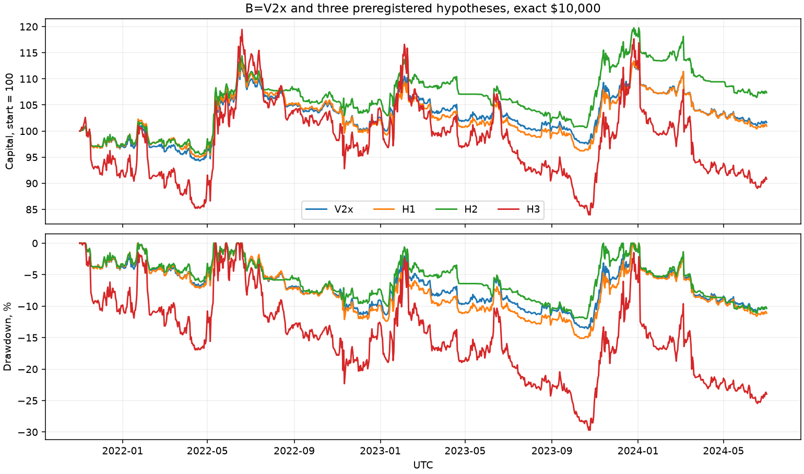
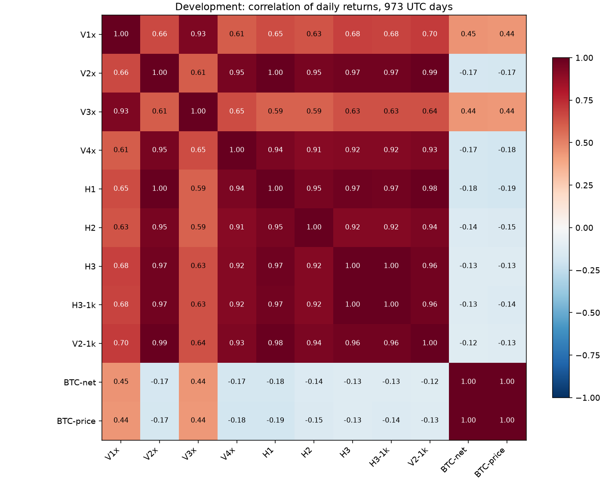

# T004b — точное количество и три гипотезы на dev

По заранее зарегистрированным критериям **H2 подтверждена на dev; H1 и H3 не подтверждены**. Это результаты трёх проверок на периоде разработки, не выбор кандидата T005 и не свидетельство устойчивого преимущества вне dev.

## Регистрация и границы

Первый коммит **1f613e7949f8663ec9f4fe67b11b6e90201a452f** отправлен до реализации и новых прогонов. Он содержит девять TOML, гипотезы, порог уменьшения пропусков на 50%, запрет дополнительных вариантов и критерии T005 (ADR-016). Параметры и критерии после получения результатов не менялись.

Все новые прогоны — чистый код **e45c9b10a9eb8a1c57e47c9a75abc8e8c729768a**, dev **2021-11-01–2024-06-30 UTC**, 973 дня, T=973/365=2.66575 года. Warmup с 2021-01-01. База **B=V2x**: 1d long_short, core15, exact, $10000. Варианты с exact отменяют только шаг количества и минимумы заявок, сохраняя издержки, фандинг и фактические лимиты 2/1.5/0.5. Семейство long_short выбрано до новых результатов как общий случай, а не по доходности V2.

[Полный вывод tb backtest compare](T004b-compare.md), [конфигурации, версии и SHA-256 артефактов](T004b-runs.json). Валютные суммы — USDT, обозначенные как доллары.

## Метрики девяти прогонов

| ID | Режим | Капитал $ | Итог $ | Доходность | CAGR | Волат. | Sharpe | SE Sharpe | Max DD | Закр. / откр. |
|---|---|---|---|---|---|---|---|---|---|---|
| V1x | exact | 10000 | 9675.24 | -3.25% | -1.23% | 8.40% | -0.105 | 0.614 | -10.41% | 211 / 1 |
| V2x | exact | 10000 | 10163.64 | 1.64% | 0.61% | 11.60% | 0.110 | 0.614 | -13.57% | 393 / 12 |
| V3x | exact | 10000 | 9458.29 | -5.42% | -2.07% | 8.40% | -0.207 | 0.619 | -10.99% | 252 / 1 |
| V4x | exact | 10000 | 10087.96 | 0.88% | 0.33% | 12.05% | 0.087 | 0.614 | -12.35% | 480 / 12 |
| H1 | exact | 10000 | 10096.69 | 0.97% | 0.36% | 11.86% | 0.090 | 0.614 | -15.12% | 383 / 12 |
| H2 | exact | 10000 | 10734.83 | 7.35% | 2.70% | 11.38% | 0.290 | 0.625 | -12.00% | 400 / 9 |
| H3 | exact | 10000 | 9079.80 | -9.20% | -3.56% | 25.74% | -0.012 | 0.612 | -29.71% | 337 / 9 |
| H3-1k | exchange | 1000 | 967.12 | -3.29% | -1.25% | 24.99% | 0.075 | 0.613 | -28.71% | 329 / 9 |
| V2-1k | exchange | 1000 | 1049.77 | 4.98% | 1.84% | 9.93% | 0.233 | 0.621 | -9.77% | 341 / 9 |

SE рассчитана заданной формулой sqrt((1 + SR²/2) / T). Она около 0.61–0.63 у всех запусков. Это приближение без поправки на автокорреляцию, тяжёлые хвосты и множественные сравнения; разница с базой сама по себе не доказывает статистическую значимость. Результат dev не используется для изменения зарегистрированных чисел или выбора финального варианта.

V1x/V3x — long_only 1d/4h; V2x/V4x — long_short 1d/4h. H1/H2/H3 отличаются от B только зарегистрированными изменениями. H3 включает перераспределение бюджета 0.005×15/5=0.015 на символ как часть концентрации.

## Изменения H1–H3 относительно B

В каждой ячейке значение / разница с B. Положительная разница max DD означает меньшую глубину просадки. Риск R — максимум за жизненный цикл; открытые позиции исключены из средних R и числа закрытых, но включены в итоговый капитал.

| Метрика | B=V2x | H1 / Δ | H2 / Δ | H3 / Δ |
|---|---|---|---|---|
| Sharpe | 0.110 | 0.090 / -0.021 | 0.290 / +0.180 | -0.012 / -0.122 |
| Max DD, п.п. | -13.570 | -15.119 / -1.549 | -12.002 / +1.567 | -29.710 / -16.140 |
| Средний выигрыш R | 1.020 | 1.083 / +0.063 | 0.912 / -0.108 | 0.881 / -0.138 |
| Средний проигрыш R | -0.587 | -0.653 / -0.066 | -0.468 / +0.119 | -0.538 / +0.049 |
| Закрытых позиций | 393.000 | 383.000 / -10.000 | 400.000 / +7.000 | 337.000 / -56.000 |
| Средняя gross | 0.142 | 0.151 / +0.009 | 0.117 / -0.025 | 0.329 / +0.188 |
| Макс. gross | 0.427 | 0.428 / +0.001 | 0.439 / +0.012 | 0.907 / +0.479 |
| Средняя net | -0.010 | -0.015 / -0.005 | -0.000 / +0.009 | -0.010 / +0.000 |

### По годам

2021 — только ноябрь–декабрь, 2024 — только январь–июнь. В ячейках доходность внутри года / разница с B в процентных пунктах; Sharpe и просадка выше рассчитаны за весь dev.

| Год | B | H1 / Δ, п.п. | H2 / Δ, п.п. | H3 / Δ, п.п. |
|---|---|---|---|---|
| 2021 | -2.83% | -2.42% / +0.41 | -2.45% / +0.38 | -7.46% / -4.63 |
| 2022 | 5.53% | 4.59% / -0.94 | 8.59% / +3.06 | 12.47% / +6.94 |
| 2023 | 8.94% | 9.58% / +0.64 | 11.42% / +2.47 | 7.60% / -1.35 |
| 2024 | -9.02% | -9.72% / -0.70 | -9.05% / -0.03 | -18.92% / -9.90 |

### Вердикты по зарегистрированным критериям

| Гипотеза | Проверка | Вердикт |
|---|---|---|
| H1 | Средний выигрыш R 1.020 → 1.083 вырос; Sharpe 0.110 → 0.090 снизился | Не подтверждена |
| H2 | Sharpe 0.110 → 0.290 выше; DD -13.57% → -12.00% менее глубокая | Подтверждена на dev |
| H3 | Sharpe exact 0.110 → -0.012 ниже; min-пропуски exchange1k снизились на 87.53% (порог 50%) | Не подтверждена |

H1: удлинение выхода повысило средний выигрыш, но также увеличило модуль среднего проигрыша и просадку. H2: в данной реализации смена режима BTC закрывает несовместимую альтовую позицию; отсутствие актуальных 100 непрерывных дневных свечей тоже запрещает альтовые цели. BTC торгуется без фильтра. Равенство SMA блокирует обе стороны альтов. Состояния каналов не сбрасываются фильтром.

H3: ранжирование по abs(100-дневная доходность)/ATR_frac, top-5, равные оценки — символ по алфавиту. Выбывшие из top-5 позиции сохраняются до сигнального выхода или стопа, но не увеличиваются и не разворачиваются. Число удерживаемых позиций может превышать пять. Концентрация уменьшила пропуски на малом счёте, однако условие улучшения Sharpe не выполнено. Гипотеза не донастраивалась.

## Корреляция дневных доходностей

Pearson на 973 общих UTC-днях без пропусков. BTC-net — сохранённый эталон T004 exchange $1000 с фандингом и издержками; BTC-price — отдельная ценовая доходность без издержек. Оба ряда относятся только к dev. В 4h сначала выбирается капитал на UTC-полуночах, затем считается дневная доходность. [Матрица без округления](T004b-correlations.json).

| ID | V1x | V2x | V3x | V4x | H1 | H2 | H3 | H3-1k | V2-1k | BTC-net | BTC-price |
|---|---|---|---|---|---|---|---|---|---|---|---|
| V1x | 1.000 | 0.661 | 0.934 | 0.609 | 0.651 | 0.632 | 0.682 | 0.680 | 0.697 | 0.448 | 0.443 |
| V2x | 0.661 | 1.000 | 0.606 | 0.950 | 0.996 | 0.951 | 0.968 | 0.965 | 0.989 | -0.165 | -0.172 |
| V3x | 0.934 | 0.606 | 1.000 | 0.654 | 0.593 | 0.587 | 0.634 | 0.634 | 0.639 | 0.441 | 0.435 |
| V4x | 0.609 | 0.950 | 0.654 | 1.000 | 0.939 | 0.911 | 0.920 | 0.919 | 0.935 | -0.174 | -0.181 |
| H1 | 0.651 | 0.996 | 0.593 | 0.939 | 1.000 | 0.948 | 0.969 | 0.966 | 0.985 | -0.178 | -0.185 |
| H2 | 0.632 | 0.951 | 0.587 | 0.911 | 0.948 | 1.000 | 0.918 | 0.916 | 0.945 | -0.140 | -0.148 |
| H3 | 0.682 | 0.968 | 0.634 | 0.920 | 0.969 | 0.918 | 1.000 | 0.998 | 0.962 | -0.125 | -0.132 |
| H3-1k | 0.680 | 0.965 | 0.634 | 0.919 | 0.966 | 0.916 | 0.998 | 1.000 | 0.963 | -0.129 | -0.136 |
| V2-1k | 0.697 | 0.989 | 0.639 | 0.935 | 0.985 | 0.945 | 0.962 | 0.963 | 1.000 | -0.120 | -0.126 |
| BTC-net | 0.448 | -0.165 | 0.441 | -0.174 | -0.178 | -0.140 | -0.125 | -0.129 | -0.120 | 1.000 | 0.999 |
| BTC-price | 0.443 | -0.172 | 0.435 | -0.181 | -0.185 | -0.148 | -0.132 | -0.136 | -0.126 | 0.999 | 1.000 |

## Что меняет округление: exact против exchange

Exact $10000 сравнивается с сохранённым exchange $1000 из T004, повторённым без изменений. В exact масштабирование капитала не меняет процентную траекторию в пределах вычислительной точности (проверено на синтетике); в exchange абсолютные минимумы меняют состав исполнений. Для V1/V2 дополнительно доступны прежние exchange $10000: это сравнение на одинаковом капитале. Новых вариантов exchange $10000 для V3/V4 не запускалось.

| Основа | Режим / капитал | Доходность | Sharpe | Max DD | Закрытых | Средняя gross | Min-пропуски | Fees % gross profit | Slip % | Funding net % |
|---|---|---|---|---|---|---|---|---|---|---|
| V1 | exchange / $1000 | 0.60% | 0.067 | -9.64% | 181 | 0.058 | 1168 | 1.34 | 0.76 | -6.73 |
| V1 | exact / $10000 | -3.25% | -0.105 | -10.41% | 211 | 0.069 | 0 | 1.49 | 0.85 | -7.57 |
| V1 | exchange / $10000 | -3.08% | -0.099 | -10.44% | 211 | 0.068 | 29 | 1.49 | 0.85 | -7.53 |
| V2 | exchange / $1000 | 4.98% | 0.233 | -9.77% | 341 | 0.117 | 3383 | 1.35 | 0.74 | -4.79 |
| V2 | exact / $10000 | 1.64% | 0.110 | -13.57% | 393 | 0.142 | 0 | 1.42 | 0.79 | -4.84 |
| V2 | exchange / $10000 | 1.87% | 0.118 | -13.44% | 393 | 0.140 | 101 | 1.43 | 0.79 | -4.82 |
| V3 | exchange / $1000 | -2.35% | -0.079 | -8.06% | 220 | 0.057 | 6487 | 1.61 | 0.93 | -5.32 |
| V3 | exact / $10000 | -5.42% | -0.207 | -10.99% | 252 | 0.070 | 0 | 1.75 | 1.00 | -6.34 |
| V4 | exchange / $1000 | 2.84% | 0.153 | -10.91% | 417 | 0.120 | 17897 | 1.53 | 0.84 | -3.55 |
| V4 | exact / $10000 | 0.88% | 0.087 | -12.35% | 480 | 0.147 | 0 | 1.58 | 0.86 | -3.87 |

Без округления все четыре варианта открывают больше закрывшихся жизненных циклов, чем соответствующие exchange $1000, и имеют большую среднюю gross-экспозицию. Во всех четырёх наблюдаемых парах доходность exact ниже. Это описание последствий дискретности заявок и последующего расхождения траекторий капитала, не утверждение о полезности искусственного пропуска сделок. Для V1/V2 разница exact и exchange при $10000 значительно меньше, чем при сравнении с exchange $1000.

Проценты издержек используют сумму положительных gross PnL жизненных циклов, включая конечную переоценку. Funding net отрицателен для расхода. Открытые позиции учитываются в капитале и суммах издержек; сделочная R-статистика относится к закрытым.

## H3-1k против V2-1k

| Метрика | V2-1k | H3-1k |
|---|---|---|
| Пропуски min | 3383 | 422 |
| Средний номинал непустой позиции, $ | 13.51 | 38.89 |
| Средний номинал исполнения, $ | 11.67 | 32.69 |
| Средняя gross | 0.1170 | 0.3151 |
| Закрытых позиций | 341 | 329 |
| Sharpe | 0.233 | 0.075 |
| Доходность | 4.98% | -3.29% |
| Max DD | -9.77% | -28.71% |

Пропуски: 3383 → 422, снижение 87.53%. Средний размер позиции: $13.51 → $38.89. Техническая часть критерия H3 пройдена, но гипотеза в целом не подтверждена из-за Sharpe exact.

Средний размер — сумма abs(qty×close) по всем непустым позициям на всех закрытиях, делённая на число таких наблюдений; плоские бары не добавляют нулевые позиции. Пропуски считаются как события заявок, а не уникальные торговые сигналы: повторяющиеся попытки увеличивают счётчик.

## Проверки и ограничения

Повторы **V1, V2, V3, V4**: все четыре parquet в каждом прогоне побайтово совпали с хешами T004, все прежние значения metrics.json совпали точно. Новые поля метрик (режим, SE и размеры позиций) и манифесты закономерно добавлены. Дополнительно тесты сравнивают V1 и BTC с замороженными синтетическими outputs старого кода; файлы не переснимались из новой реализации. T003/T004 по умолчанию остаётся exchange.

258 offline-тестов, ruff check, ruff format --check, mypy src прошли. [CI реализации на Ubuntu и Windows](https://github.com/branch-danya-dev/trending-basket/actions/runs/36510759854) зелёный. Проверены зеркальный H2, свежесть/непрерывность BTC, текущая незакрытая дневная свеча, top-K без будущих данных, сохранение старых позиций, запрет увеличения при гэпе, отсутствие скрытого минимума у микроскопического exact-количества, капитал с издержками/фандингом и фактические лимиты после ребалансировки.

| ID | Покрытие funding | Observed / expected | Пропуски | Делистинги |
|---|---|---|---|---|
| V1x | 100.00% | 12158 / 12158 | 0 | 0 |
| V2x | 100.00% | 31747 / 31747 | 0 | 1 |
| V3x | 100.00% | 11306 / 11306 | 0 | 0 |
| V4x | 100.00% | 31178 / 31178 | 0 | 1 |
| H1 | 100.00% | 33259 / 33259 | 0 | 1 |
| H2 | 100.00% | 23112 / 23112 | 0 | 1 |
| H3 | 100.00% | 25322 / 25322 | 0 | 1 |
| H3-1k | 100.00% | 24893 / 24893 | 0 | 1 |
| V2-1k | 100.00% | 27238 / 27238 | 0 | 1 |

Во всех новых прогонах сумма вкладов символов совпадает с изменением капитала до 1e−6, фактические лимиты соблюдены до 1e−9. В exact нет min-пропусков. Данные и снимок те же, что в T004; пропущенных ожидаемых выплат при удержании не выявлено. Параметры биржи текущие; exact сознательно игнорирует их минимумы. Остаточная ошибка выжившего, неопределённое время OHLC-стопа и отсутствие модели маржи/ликвидаций сохраняются.

Журнал `reports/period-access-log.jsonl` отсутствует: трендовая стратегия не запускалась на val, holdout или full. Защита периодов остаётся включённой. После просмотра результатов не изменены ни гипотезы, ни числа, ни пороги; комбинаций и дополнительных исследовательских вариантов не было.

### Каталоги воспроизведения

| ID | Каталог |
|---|---|
| V1-regression | reports/V1-20260929T020219Z |
| V2-regression | reports/V2-20260929T020225Z |
| V3-regression | reports/V3-20260929T020240Z |
| V4-regression | reports/V4-20260929T020259Z |
| V1x | reports/V1x-20260929T020305Z |
| V2x | reports/V2x-20260929T020311Z |
| V3x | reports/V3x-20260929T020325Z |
| V4x | reports/V4x-20260929T020345Z |
| H1 | reports/H1-20260929T020351Z |
| H2 | reports/H2-20260929T020357Z |
| H3 | reports/H3-20260929T020404Z |
| H3-1k | reports/H3-1k-20260929T020410Z |
| V2-1k | reports/V2-1k-20260929T020416Z |

Команда каждого зарегистрированного прогона: `uv run tb backtest run experiments/<ID>.toml`; затем `uv run tb backtest compare` со списком девяти каталогов. Полные исходные отчёты и манифесты остаются локально в reports. В Git сохранены сводка, сравнение, корреляции, графики и контрольные суммы.

## Зафиксированный переход к T005

Кандидаты: **V1x, V2x, V3x, V4x, H1, H2, H3**, все exact. Dev-вердикты не меняют заранее заданный список. На val выбирается наибольший Sharpe при не менее 100 закрытых позиций и max DD не хуже −20%; неопределённый Sharpe исключается, точное равенство разрешается по ID. При отсутствии допустимого кандидата holdout не запускается.

Единственный holdout выбранного кандидата проходит только при одновременном Sharpe>0, max DD≥−25% и net-доходности выше net-доходности exact buy_and_hold_btc, умноженной на отношение годовой волатильности кандидата к волатильности BTC на том же окне. Это заданный арифметический ориентир, не дополнительная стратегия. При нулевой/неопределённой волатильности BTC критерий не признаётся пройденным. Провал holdout запрещает переход семейства к исполнению, изменение параметров или продление окна ради повторной попытки.

В T004b кандидат T005 не выбран. «Подтверждена на dev» для H2 означает только выполнение двух заранее заданных сравнений с B.
