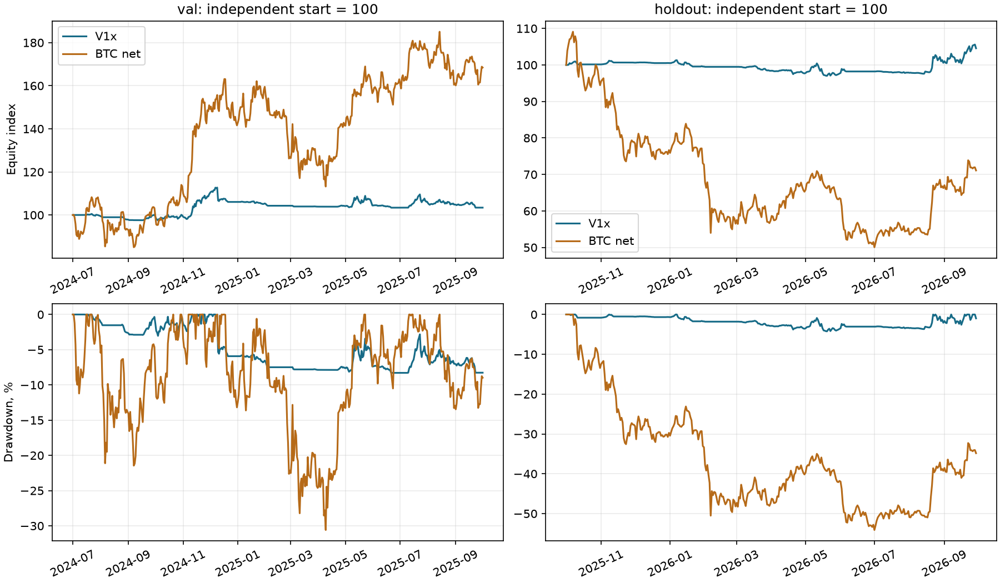

# T005 — валидация и единственная проверка holdout

**Механически выбран V1x; holdout пройден по всем трём условиям ADR-016.**
По заранее записанной ветке ADR-017 разрешён переход к T006 (Demo) с малым риском.
Риск ещё не выбран, Demo не запущен. Проверка exchange $1000 на val выявила
936 пропусков минимальных заявок: допуск семейства не означает подтверждённую
реализуемость точной стратегии на маленьком счёте.

## Порядок фиксации

| Этап | Коммит / факт |
|---|---|
| Критерии ADR-016 до T004b | 1f613e7949f8663ec9f4fe67b11b6e90201a452f |
| Исходы T005, первый коммит до val | 11b0e6f; ADR-017, семь val TOML и два эталона |
| Код val и механического решения | 51cb12db298dbffb4db0e696fa4067be45d41847 |
| Выбор V1x отправлен до holdout | f56856127822c79cc2faefd06efc78cf14bfe6bb |
| Вердикт и разрешение проверки $1000 | e06378ba94ca37f3dfb76b817ac78a4cf3fdbaaa |

Все 12 новых запусков имеют чистое дерево Git в манифесте: девять val,
два holdout и один условный val exchange. Никаких изменений параметров,
комбинаций гипотез и повторов стратегии на holdout не было. Разогрев с 2021-01-01
использует только уже закрытые свечи; каждый прогон начинает с нулевых состояний
и без переноса позиций из предыдущего периода. Это отдельные эксперименты,
их доходности не складываются в одну непрерывную торговую историю.

[Результат выбора](T005-selection.json), [вердикт](T005-holdout.json),
[конфигурации, скалярные метрики, годы, монеты и SHA-256](T005-runs.json).

## Семь кандидатов на val

**2024-07-01–2025-09-30 UTC**, 457 дней, exact $10000. Кандидаты совпадают с
T004b, изменён только period. Издержки и исторический funding включены.

| ID | Доходность | CAGR | Волат. | Sharpe | SE | Max DD | Закрытых | Средняя gross | Отбор |
|---|---|---|---|---|---|---|---|---|---|
| V1x | 3.42% | 2.72% | 9.71% | 0.326 | 0.917 | -8.28% | 117 | 8.36% | Допущен |
| V2x | -5.71% | -4.59% | 11.43% | -0.353 | 0.921 | -11.27% | 217 | 13.16% | Допущен |
| V3x | -0.51% | -0.41% | 9.31% | 0.003 | 0.894 | -8.02% | 145 | 8.26% | Допущен |
| V4x | -11.74% | -9.50% | 11.57% | -0.804 | 1.028 | -13.05% | 287 | 13.66% | Допущен |
| H1 | -3.12% | -2.50% | 11.66% | -0.159 | 0.899 | -8.05% | 194 | 14.10% | Допущен |
| H2 | -5.60% | -4.49% | 11.62% | -0.337 | 0.919 | -12.15% | 259 | 11.69% | Допущен |
| H3 | -25.49% | -20.95% | 24.71% | -0.827 | 1.035 | -26.46% | 182 | 31.06% | DD хуже −20% |

Sharpe, волатильность и SE рассчитаны по дневным доходностям, включая варианты
4h. SE = sqrt((1+SR²/2)/(457/365)); это приближение без поправки на зависимость,
тяжёлые хвосты и множественные сравнения. Max DD использует все бары,
средняя gross — закрытия баров. [Полный compare val](T005-compare-val.md).

## Эталоны val

Оба exact $10000. BTC держит фиксированное количество после первого входа,
его контроль экспозиции отключён; равновесная корзина пересобирается ежемесячно.

| ID | Доходность | CAGR | Волат. | Sharpe | SE | Max DD | Закрытых | Средняя gross |
|---|---|---|---|---|---|---|---|---|
| BTC net | 68.44% | 51.66% | 47.70% | 1.110 | 1.136 | -30.59% | 0 | 104.27% |
| Equal weight | 3.83% | 3.05% | 85.20% | 0.459 | 0.940 | -64.60% | 42 | 99.92% |

**Ценовая доходность BTC без фандинга и издержек: 81.70%.**
Эталон BTC уплатил funding **$1408.35**, получил
$91.87, net funding $-1316.47.
Это отдельная строка, не подмена net BTC ценовым рядом.

## Применение правила выбора

1. У всех семи определён Sharpe и не меньше 100 закрытых позиций.
2. H3 исключён: max DD -26.46% хуже −20%.
3. Шесть допустимых по убыванию Sharpe: V1x, V3x, H1, H2, V2x, V4x.
   Точного равенства на максимуме нет; правило разрешило бы его по ID.
4. Выбран **V1x**, long_only 1d. H2 был лучше на dev, но это не влияет на
   зарегистрированный отбор. JSON выбора закоммичен и отправлен до доступа к holdout.

## Выбранный V1x: dev и val

Dev — 2021-11-01–2024-06-30, 973 дня; используется сохранённый T004b exact
прогон, новый dev не запускался. Val — 457 дней. Оба капитала $10000.

| ID | Доходность | CAGR | Волат. | Sharpe | SE | Max DD | Закрытых | Средняя gross |
|---|---|---|---|---|---|---|---|---|
| V1x dev | -3.25% | -1.23% | 8.40% | -0.105 | 0.614 | -10.41% | 211 | 6.94% |
| V1x val | 3.42% | 2.72% | 9.71% | 0.326 | 0.917 | -8.28% | 117 | 8.36% |

| Период | Год | Фрагмент | Доходность | Net PnL $ | Net funding $ |
|---|---|---|---|---|---|
| dev | 2021 | ноябрь–декабрь | -3.62% | -361.57 | -22.00 |
| dev | 2022 | полный год | -5.63% | -542.42 | -7.49 |
| dev | 2023 | полный год | 15.79% | 1436.54 | -80.94 |
| dev | 2024 | январь–июнь | -8.14% | -857.32 | -102.67 |
| val | 2024 | июль–декабрь | 6.06% | 606.33 | -99.43 |
| val | 2025 | январь–сентябрь | -2.49% | -264.09 | -56.06 |

Годовые доходности считаются от капитала на начале соответствующего фрагмента,
не от постоянных $10000. Неполные годы отмечены; между dev/val есть сброс капитала.

## Единственный holdout

**2025-10-01–2026-09-28 UTC**, 363 полностью закрытых дня. 29 сентября на момент
запуска не закрыто. Только V1x и BTC, exact $10000, одинаковые даты.
Конечные открытые позиции переоценены без фиктивного закрытия.

| ID | Доходность | CAGR | Волат. | Sharpe | SE | Max DD | Закрытых | Средняя gross |
|---|---|---|---|---|---|---|---|---|
| V1x | 4.57% | 4.59% | 6.69% | 0.705 | 1.120 | -4.23% | 66 | 6.20% |
| BTC net | -28.90% | -29.03% | 45.86% | -0.518 | 1.068 | -54.12% | 0 | 101.81% |

**Ценовая доходность BTC без фандинга и издержек: -26.80%.**
Эталон BTC уплатил funding **$261.09**, получил
$58.11; net funding $-202.98.
[Полный compare holdout](T005-compare-holdout.md).

| Условие ADR-016 | Расчёт без изменения знака BTC | Результат |
|---|---|---|
| Sharpe > 0 | 0.7045645034 > 0 | Пройдено |
| Max DD >= −25% | -4.22859847% >= −25% | Пройдено |
| Return > BTC net × vol / BTC vol | 4.56611058% > -28.89904739% × (0.0668761036 / 0.4586316539) = -4.21396053% | Пройдено |

Отношение волатильностей 0.1458165895; волатильность BTC положительна.
Порог отрицателен, потому что net BTC на этом окне отрицателен. В формуле
использован именно его знак; модуль, ценовой BTC или безрисковая альтернатива
не подставлялись. Скрипт записал **passed=true**.

Закрытых позиций 66: порог 100 относится к отбору на val и не добавляется
задним числом к holdout. SE Sharpe **1.120** за
363 дня велика. Проход разрешает осторожный Demo, но не доказывает преимущество:
примерно год даёт SE около 1, а Sharpe>0 у системы без преимущества возникает
примерно в половине случаев. Риск для Demo/live выбирается в T006 только по dev/val.



## Условная проверка exchange $1000 на val

Запущена только после вычисленного прохода и его коммита. Тот же V1x, тот же val,
прежние риск и издержки; меняются только капитал и модель количества.
Отложенный период больше не использовался.

| Метрика | Exact $10000 | Exchange $1000 |
|---|---|---|
| Доходность | 3.42% | 2.47% |
| Sharpe | 0.326 | 0.289 |
| Max DD | -8.28% | -6.85% |
| Пропуски minimum_order_skip | 0 | 936 |
| Закрытые позиции | 117 | 93 |
| Средняя gross | 8.36% | 5.10% |
| Средний номинал позиции $ | 199.75 | 16.46 |
| Средний номинал / исходный капитал | 2.00% | 1.65% |

Разница exchange−exact: **-0.95 п.п.**
доходности. Exact-номинал, линейно нормированный к $1000, был бы
$19.98; фактический exchange —
$16.46. Это масштабирование сохранённой
метрики, дополнительного exact $1000 прогона не было.

Пропуск — попытка заявки, а не уникальная сделка. 936 пропусков и снижение
средней экспозиции с 8.36% до
5.10% показывают существенное искажение реализации.
Меньшая просадка exchange не доказывает улучшение стратегии. Порог 100 позиций
к этой проверке реализуемости повторно не применяется. Результат передаётся
в T006, без решения о повышении риска или минимальном депозите в T005.
[Полный compare exact/exchange](T005-compare-exchange.md).

## Данные и проверки

Перед holdout докачаны 79 дневных свечей 2026-09-28 из API Bybit. Проверены
188 рядов (94 символа × 1d/4h): нет внутренних пропусков, некорректных свечей
или недостающего конца до delisting/конца окна. Universe и параметры инструментов
из сохранённого снимка T002a; состав задним числом не перестраивался.

Все 12 запусков: coverage funding при открытых позициях **100%**, список
пропущенных расчётов пуст; интервалы восстановлены из истории каждого символа.
Предварительная проверка полных историй показывает краевые экстраполяции до
первого funding у новых листингов и последнюю ожидаемую отметку LINA при делистинге.
Это границы наблюдаемого расписания, не подтверждённые пропуски во время позиций;
они не затронули ни один платёж этих запусков. Регулярно отсутствующие записи
API всё ещё могут выглядеть как более редкое расписание — ограничение ADR-014.

PnL по символам сходится с изменением капитала с погрешностью <1e−6 USD.
Независимый пересчёт Sharpe, волатильности и max DD из equity.parquet всех
12 запусков совпал с metrics.json с допуском 1e−12.
Фактические лимиты после ребалансировок соблюдены в пределах 1e−9; BTC-эталон
освобождён от лимитов по прежней конфигурации. [Аудит данных и запусков](T005-data-audit.json).
Остаются ограничения: текущие биржевые фильтры, неполное восстановление
делистингов, остаточная ошибка выжившего, OHLC-время стопов и отсутствие модели
маржи/ликвидаций. У некоторых Closed отсутствует minNotionalValue; предупреждение
сохранено. Exact обходится без минимумов, exchange использует доступные фильтры.

Локально: ruff check, ruff format --check, mypy src и **283 offline-теста** прошли.
CI кода 51cb12d на Ubuntu и Windows:
[36512936632](https://github.com/branch-danya-dev/trending-basket/actions/runs/36512936632).
Тесты: каждое исключение/условие, строгие границы и равенства, выбор максимума,
tie-break ID, пустой допуск, нулевая/неопределённая BTC vol, неизменность
конфигурации, несовпадающие окна, отказ перезаписи решения, блокировка повторного
holdout/full до чтения данных и предупреждение при синтетическом override.

## Полный журнал доступа

Ниже всё содержимое `reports/period-access-log.jsonl`: восемь val (семь exact
и одна условная exchange проверка) и **ровно один holdout стратегии**.
Эталоны, согласно ADR-015, не требуют защищённого допуска и не пишутся в этот
журнал; их версии/даты сохранены в T005-runs.json. Override не использован.
[Отдельная копия журнала](T005-period-access-log.jsonl).

```jsonl
{"commit": "51cb12db298dbffb4db0e696fa4067be45d41847", "experiment": "V1x", "period": "val", "strategy": "trend_basket", "time_ms": 1790649111846}
{"commit": "51cb12db298dbffb4db0e696fa4067be45d41847", "experiment": "V2x", "period": "val", "strategy": "trend_basket", "time_ms": 1790649118480}
{"commit": "51cb12db298dbffb4db0e696fa4067be45d41847", "experiment": "V3x", "period": "val", "strategy": "trend_basket", "time_ms": 1790649125234}
{"commit": "51cb12db298dbffb4db0e696fa4067be45d41847", "experiment": "V4x", "period": "val", "strategy": "trend_basket", "time_ms": 1790649137457}
{"commit": "51cb12db298dbffb4db0e696fa4067be45d41847", "experiment": "H1", "period": "val", "strategy": "trend_basket", "time_ms": 1790649150815}
{"commit": "51cb12db298dbffb4db0e696fa4067be45d41847", "experiment": "H2", "period": "val", "strategy": "trend_basket", "time_ms": 1790649157636}
{"commit": "51cb12db298dbffb4db0e696fa4067be45d41847", "experiment": "H3", "period": "val", "strategy": "trend_basket", "time_ms": 1790649164628}
{"commit": "f56856127822c79cc2faefd06efc78cf14bfe6bb", "experiment": "V1x", "period": "holdout", "strategy": "trend_basket", "time_ms": 1790649282789}
{"commit": "e06378ba94ca37f3dfb76b817ac78a4cf3fdbaaa", "experiment": "V1x-1k", "period": "val", "strategy": "trend_basket", "time_ms": 1790649375634}
```

## Решение по заранее закреплённой ветке

Применяется ветка **«holdout пройден» ADR-017**: можно перейти к T006 для
подготовки Demo с малым риском. Риск выбирается только по dev/val; проблемы
минимальных заявок на $1000 рассматриваются в T006. Нового выбора кандидата,
изменения параметров или повторного holdout не будет. T005 не разрешает live.
